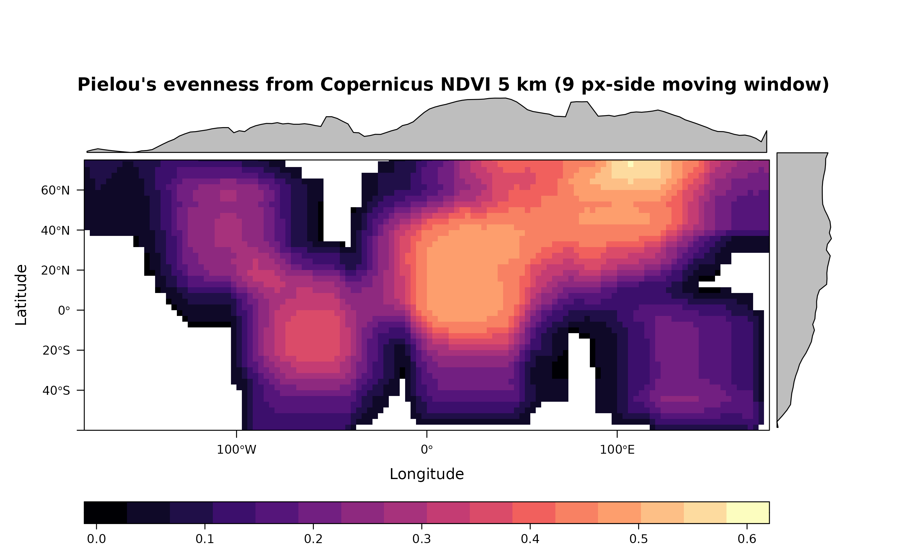
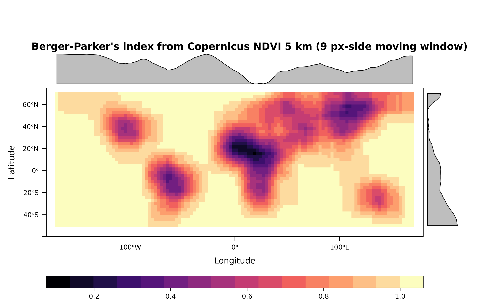
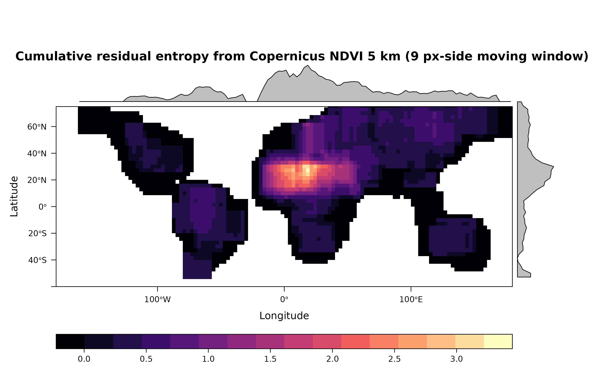
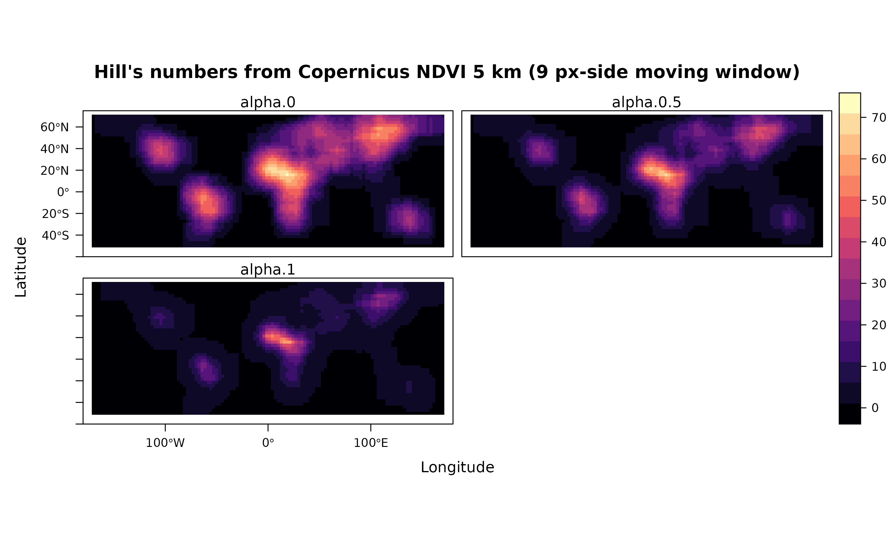

# Indices of diversity from NDVI.

``` r
require(rasterdiv)
require(terra)
require(rasterVis)
require(RColorBrewer)
```

This vignette uses **rasterdiv** to build global series of indices of
diversity based on Information Theory. The input dataset is the
Copernicus Long-term (1999-2017) average Normalised Difference
Vegetation Index for the 21st of June (copNDVI).

``` r
copNDVI <- load_copNDVI()
```

## Overview

A SpatRaster called copNDVI is loaded together with the package
**rasterdiv**. *copNDVI* is a 8-bit raster, meaning that pixel values
range from 0 to 255. You could *stretch* it to match a more familiar
(-1,1) values range using `terra::stretch(copNDVI,minv=-1,maxv=1)`. The
original dataset was resampled to 1/20th its spatial resolution and
pixels with values 253, 254 and 255 (water) were set as NA’s.

``` r
#Resample using terra::aggregate and a linear factor of 10
copNDVI <- terra::aggregate(copNDVI, fact=20)
```

## Compute all indexes in rasterdiv on copNDVI

**rasterdiv** allows the computation of 8 diversity indexes based on
information theory. In the following section, all these indexes will be
computed for *copNDVI* using a moving window of 81 pixels (9 px side).
Alpha values for the Hill, Rényi and parametric Rao indexes will be set
from 0 to 2 every 0.5. In addition, we will set `na.tolerance=0.2`,
meaning that all moving windows with more than 10% of pixels equal NA
will be set to NA.

``` r
#Shannon's Diversity
sha <- Shannon(copNDVI,window=9,na.tolerance=0.2,np=1)

#Pielou's Evenness
pie <- Pielou(copNDVI,window=9,na.tolerance=0.2,np=1)

#Berger-Parker's Index
ber <- BergerParker(copNDVI,window=9, na.tolerance=0.2, np=1)

#Parametric Rao's quadratic entropy with alpha ranging from 1 to 3
prao <- paRao(copNDVI, window=9, alpha=c(1:3), na.tolerance=0.8, dist_m="euclidean", np=1)

#Cumulative residual entropy 
cre <- CRE(copNDVI, window=9, na.tolerance=1, np=1, simplify=0)

#Hill's numbers
hil <- Hill(copNDVI, window=9, alpha=seq(0,1,0.5), na.tolerance=0.2, np=1)

#Rényi's Index
ren <- Renyi(copNDVI, window=9, alpha=seq(0,1,0.5), na.tolerance=0.2, np=1)
```

## Visualise output `SpatRasters` (the shape of continents is deformed by the NAs in the 9x9 moving windows)

``` r
#Shannon's Diversity
levelplot(sha, main="Shannon's entropy from Copernicus NDVI 5 km (9 px-side moving window)", as.table = T,layout=c(0,1,1), ylim=c(-60,75), margin = list(draw = TRUE))
```


``` r
#Pielou's Evenness
levelplot(pie, main="Pielou's evenness from Copernicus NDVI 5 km (9 px-side moving window)", as.table = T, layout=c(0,1,1), ylim=c(-60,75), margin = list(draw = TRUE))
```



``` r
#Berger-Parker' Index
levelplot(ber, main="Berger-Parker's index from Copernicus NDVI 5 km (9 px-side moving window)", as.table = T, layout=c(0,1,1), ylim=c(-60,75), margin = list(draw = TRUE))
```



``` r
#Parametric Rao's quadratic Entropy
levelplot(rast(prao[[1]]), main="Parametric Rao's quadratic entropy from Copernicus NDVI 5 km (9 px-side moving window)", as.table = T,layout=c(0,3,1), ylim=c(-60,75), margin = list(draw = TRUE))
```


``` r
#Cumulative residual entropy
levelplot(cre, main="Cumulative residual entropy from Copernicus NDVI 5 km (9 px-side moving window)", as.table = T, layout=c(0,1,1), ylim=c(-60,75), margin = list(draw = TRUE))
```



``` r
#Hill's numbers (alpha=0, 0.5 and 1)
levelplot(terra::rast(hil), main="Hill's numbers from Copernicus NDVI 5 km (9 px-side moving window)", as.table = T, layout=c(0,3,1), ylim=c(-60,75))
```



``` r
#Renyi' Index (alpha=0, 0.5 and 1)
levelplot(terra::rast(ren), main="Renyi's entropy from Copernicus NDVI 5 km (9 px-side moving window)", as.table = T,layout=c(0,3,1), names.attr=paste("alpha",seq(0,1,0.5),sep=" "), ylim=c(-60,75), margin = list(draw = FALSE))
```


