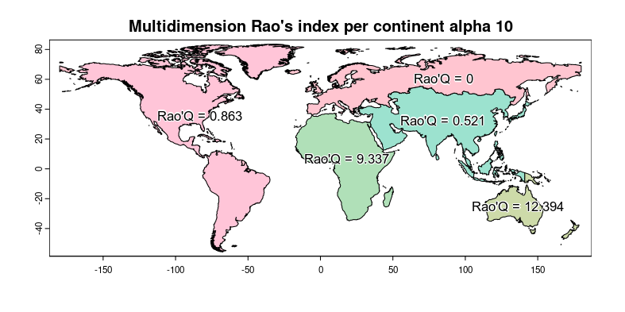
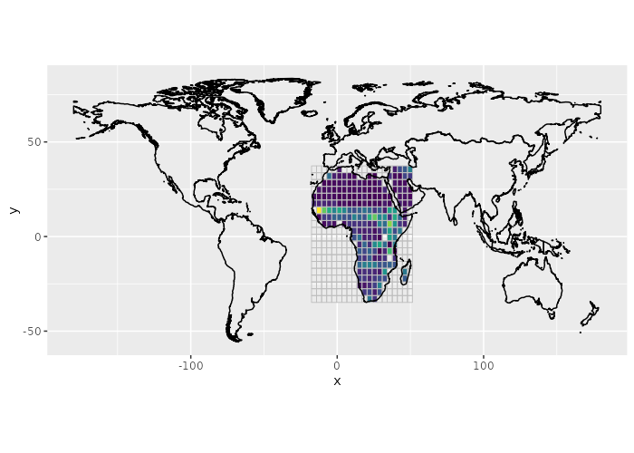

```{r setup, include=FALSE}
knitr::opts_chunk$set(fig.width=10, fig.height=10,fig.asp = 0.618, out.width = "95%", fig.align = "center", fig.dpi = 150, collapse = FALSE, comment = "#") 
#knitr::opts_chunk$set(dev = 'pdf')
```

```{r results='hide', message=FALSE, warning=FALSE}
require(rasterdiv)
require(terra)
require(rasterVis)
require(RColorBrewer)
require(viridis)
require(latticeExtra)
require(ggplot2)
```
This vignette uses **rasterdiv** to derive classic and multidimension area-based Rao's index from an input vector layer and multiple raster layers.

## Overview
A SpatRaster called copNDVI is loaded together with the package **rasterdiv**. *copNDVI* is a 8-bit raster, meaning that pixel values range from 0 to 255. You could *stretch* it to match a more familiar (-1,1) values range using `terra::stretch(copNDVI,minv=-1,maxv=1)`. The original dataset was resampled to 1/10th of its spatial resolution and pixels with values 253, 254 and 255 (water) were set as NA's.

```{r results='hide', message=FALSE, warning=FALSE, eval=FALSE}
copNDVI <- load_copNDVI()
copNDVIlr <- terra::aggregate(copNDVI, fact=10)
values(copNDVIlr) <- as.integer(values(copNDVIlr))
world <- load_world()
```

## Compute Area based Rao's Index
```{r echo = T, results = 'hide', warning=FALSE, message=FALSE, eval=FALSE}
RaoC <- paRao(x=copNDVIlr, area=world, field='CONTINENT', alpha=c(1,2))
```

```{r fig01, warning=FALSE, message=FALSE, eval=FALSE, eval=FALSE}
#Plot classic area-based Rao's index
plot(RaoC, col=hcl(RaoC$alpha.1*10), main="Classic Rao's index per continent alpha 1")
text(RaoC, label=paste("Rao'Q =", round(RaoC$alpha.1,1)), col="black", family="Arial", halo=TRUE)
```

## Compute multidimension area-based Rao's Index
```{r echo = T, results = 'hide', warning=FALSE, message=FALSE, eval=FALSE}
# Adding a second "noise" SpatRaster layer
# copNDVIlr <- terra::aggregate(copNDVI, fact=20)
values(copNDVIlr) <- as.integer(values(copNDVIlr))
noise = rast(copNDVIlr)
noise[] = as.integer(runif(n=ncell(noise),min=1, max=10))
RaoMC <- paRao(x=c(copNDVIlr,noise), area=world, field='CONTINENT', alpha=2, method="multidimension", simplify=0)
```

```{r fig02, warning=FALSE, message=FALSE, eval=FALSE}
#Plot area-based Rao's index
plot(RaoMC, col=hcl(RaoMC$alpha.2*10000), main="Multidimension Rao's index per continent alpha 10")
text(RaoMC, label=paste("Rao'Q =", round(RaoMC$alpha.2,3)), col="black", family="Arial", halo=TRUE)
```

```{r include-figure02, echo=FALSE, fig.align='center', fig.cap='', out.width='80%', eval=FALSE}

```

## Additional example subsetting on a continent and then using a grid vector to derive Rao's in each cell

```{r echo = T, results = 'hide', warning=FALSE, message=FALSE, eval=FALSE}
#Subset
africa <- subset(world, world$CONTINENT=="Africa")

#Make the raster grid
africa.r <- rast(ext(africa), nrow=20, ncol=20, crs = "+proj=longlat +datum=WGS84 +no_defs +ellps=WGS84 +towgs84=0,0,0")
africa.r[] <- 1:ncell(africa.r)

#Vectorise the SpatRaster
africa.v = as.polygons(africa.r)
```

```{r echo = T, results = 'hide', warning=FALSE, message=FALSE, eval=FALSE}
#Derive Rao's (alpha=2) for each grid cell
RaoGRID <- paRao(x=copNDVIlr, area=africa.v, field='lyr.1', alpha=2, simplify=0, na.tolerance=0.2)
```

```{r results='hide', message=FALSE, warning=FALSE, include = FALSE, eval=FALSE}
RaoGRID <- readRDS("RaoGRID.RDS")
```

```{r echo = T, results = 'hide', warning=FALSE, message=FALSE, eval=FALSE}
#Transform the spatial polygon data frame in a raster layer that can be used in levelplot
rr <- rast(RaoGRID, ncol=20, nrow=20)
values(rr) <- RaoGRID$alpha.2
```

```{r fig03, echo = T, results = 'hide', warning=FALSE, message=FALSE, eval=FALSE}
#Plot Rao's per grid cell
ggplot() +
  geom_raster(data = as.data.frame(rr, xy=TRUE), aes(x = x, y = y, fill = lyr.1)) +
  scale_fill_viridis(option = "D", direction = 1) +
   geom_polygon(data = fortify(as(africa.v, "Spatial")), aes(x = long, y = lat, group = group), fill = NA, color = "grey", linewidth=0.3) +
  geom_polygon(data = fortify(as(world, "Spatial")), aes(x = long, y = lat, group = group), fill = NA, color = "black", , linewidth=0.5) +
  theme(legend.position = "none", aspect.ratio = 0.5)
```

```{r include-figure03, echo=FALSE, fig.align='center', fig.cap='', out.width='100%', eval=FALSE}

```