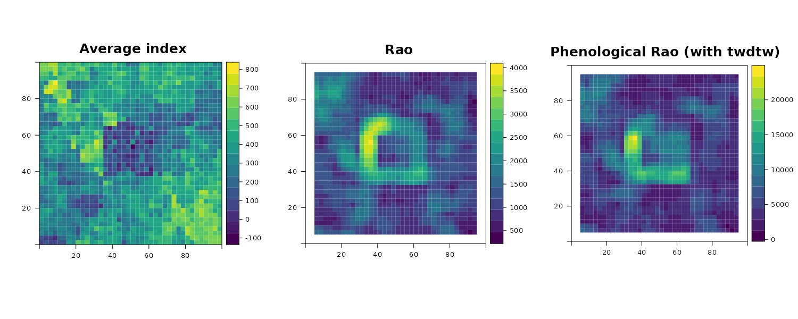

```{r setup, include=FALSE ,results='hide'}
knitr::opts_chunk$set(fig.width=12, fig.height=8, out.width = "95%", fig.align = "center", fig.dpi = 150, collapse = TRUE, comment = "#") 
```

```{r results='hide', message=FALSE, warning=FALSE}
library(terra)
library(gstat)
library(rasterdiv)
library(rasterVis)
library(viridis)
```

# Overview
In this vignette, we demonstrate how to compute the multidimensional Rao's Index using **rasterdiv** for multiple numerical matrices, represented as spatially autocorrelated *SpatRaster* objects.

## Creating Autocorrelated Spatial Patterns
First, we establish a grid that will be used to create spatial patterns through a semivariogram model.

```{r results='hide', message=FALSE, warning=FALSE}
gridDim <- 40
xy <- expand.grid(x=1:gridDim, y=1:gridDim)
```
Next, we define a semivariogram and use it to simulate autocorrelated spatial data.

```{r results='hide', message=FALSE, warning=FALSE}
varioMod <- vgm(psill=0.005, range=100, model='Exp')
zDummy <- gstat(formula=z~1, locations = ~x+y, dummy=TRUE, beta=200, model=varioMod, nmax=1)
set.seed(123)
xyz <- predict(zDummy, newdata=xy, nsim=2)
```

With the simulated data, we then create two SpatRaster objects that could represent environmental conditions like plant functional traits.

```{r results='hide', message=FALSE, warning=FALSE}
# Define coordinate reference system
utm32N <- "+proj=utm +zone=32 +ellps=WGS84 +datum=WGS84 +units=m +no_defs"
# Create SpatRasters
r <- terra::rast(nrow=40, ncol=40, crs=utm32N, ext=ext(0,10000, 0,10000))
r1 <- r
# Populate with simulated values
values(r) <- xyz$sim1
values(r1) <- xyz$sim2
```
## Computing Multidimensional Rao's Index

We now calculate the multidimensional Rao's Index using varying window sizes and alpha values.

```{r results='hide', message=FALSE, warning=FALSE, eval=FALSE}
mRao <- paRao(x=list(r, r1), window=c(3, 5), alpha=c(1, Inf), na.tolerance=1, method="multidimension", simplify=3)
```
The output is a nested list of SpatRaster which we can transform in a stack of SpatRaster and plotted together with the input layers, as follows:

### Visualisation of the result

```{r results='hide', message=FALSE, warning=FALSE, eval=FALSE}
# Create a list of all the rasters to plot
rasters_to_plot <- c(r, r1, mRao[[1]]$alpha.1, mRao[[2]]$alpha.Inf)
names(rasters_to_plot) <- c("Raster1", "Raster2", "Rao_Index_Window_3", "Rao_Index_Window_5")
```
```{r results='hide', message=FALSE, warning=FALSE, include = FALSE}
rasters_to_plot <- readRDS("rasters_to_plot.RDS")
```

```{r results='hide', message=FALSE, warning=FALSE}
# Use lapply to create a list of levelplots
plots_list <- lapply(rasters_to_plot, function(rst) {
  levelplot(as.matrix(rst, wide=TRUE), margin=FALSE, 
  col.regions=magma(100), 
  main=list(label=names(rst), 
  cex=1.5))
})

# Arrange the plots in a grid
do.call(gridExtra::grid.arrange, c(plots_list, ncol = 2))
```

## Computing Multidimensional Rao's Index for Time Series

Now, we demonstrate how to compute the multidimensional Rao's Index for a time series of rasters accounting for phenology, and compare it with Rao's Index on the same time series without a distance metrics that account for phenology.

## Creating Autocorrelated Spatio-Temporal Patterns
```{r results='hide', message=FALSE, warning=FALSE}
# Define variogram model for spatial autocorrelation
varioMod <- vgm(psill=2, range=20, model='Exp')

# Generate initial spatially correlated data
zDummy <- gstat(formula=z~1, locations = ~x+y, dummy=TRUE, beta=1, model=varioMod, nmax=1)
set.seed(123)
initial_spatial_data <- predict(zDummy, newdata=xy, nsim=1)
initial_spatial_matrix <- matrix(as.integer(initial_spatial_data$sim1 * 100), nrow=gridDim, ncol=gridDim)
```

```{r results='hide', message=FALSE, warning=FALSE}
# Generate a time series with temporal correlation
t_steps <- 100
s_dims <- c(gridDim, gridDim)
seasonal_amplitude <- 10
seasonal_amplitudeR <- 5
seasonal_frequency <- 2 * pi / t_steps
seasonal_frequencyR <- 2 * pi / t_steps
non_seasonal_mask <- matrix(FALSE, nrow=gridDim, ncol=gridDim)
non_seasonal_mask[15:25, 15:25] <- TRUE  # 11 rows centered in the middle
```

```{r results='hide', message=FALSE, warning=FALSE}
# Initialize the 3D array to store the time series data
time_series_data <- array(0, dim=c(s_dims, t_steps))

# Set the first time step with the generated spatial data
initial_spatial_matrix[non_seasonal_mask] <- floor(rnorm(length(initial_spatial_matrix[non_seasonal_mask]), mean(initial_spatial_matrix), sd = 50))

time_series_data[,,1] <- initial_spatial_matrix
```

The temporally autocorrelated matrices show different seasonality for a square area at the centre. This area may for example represents a building or another land cover type with less pronounced seasonal variation and overall lower index diversity. See the time series plotted below that visualises the different trends in index values for a subset of pixels, inside and outside the square area.

```{r results='hide', message=FALSE, warning=FALSE}
# Generate the remaining time steps
for (t in 2:t_steps) {
  for (i in 1:s_dims[1]) {
    for (j in 1:s_dims[2]) {
      if (non_seasonal_mask[i, j]) {
        seasonal_effect <- seasonal_amplitudeR * sin(seasonal_frequencyR * t)
        noise <- rnorm(1, mean = 0, sd = 1)
        time_series_data[i, j, t] <- as.integer(time_series_data[i, j, t - 1] + seasonal_effect + noise)
      } else {
        seasonal_effect <- seasonal_amplitude * sin(seasonal_frequency * t)
        noise <- rnorm(1, mean = 0, sd = 2)  # Adding some noise for variability
        time_series_data[i, j, t] <- as.integer(time_series_data[i, j, t - 1] + seasonal_effect + noise)
      }
    }
  }
}
```

```{r results='hide', message=FALSE, warning=FALSE}
# Convert the 3D array to a SpatRaster for visualization
raster_ts <- rast(time_series_data, extent = ext(0, 40, 0, 40), crs=utm32N)

# Plot the time series for a few specific pixels to illustrate the seasonal pattern
plot(1:t_steps, seq(min(as.matrix(raster_ts)), max(as.matrix(raster_ts)), length.out = t_steps), type = 'o', col = 'white', xlab = 'Time Step', ylab = 'Value')

for (cl in sample(ncol(raster_ts),10)) {
  for (rw in sample(ncol(raster_ts),10)) {
    pixel_time_series <- time_series_data[rw, cl, ]
    lines(1:t_steps, pixel_time_series, col = rgb(red = 0, green = 0, blue = 1, alpha = 0.3),ylab="Index value")
  }
}
```

```{r results='hide', message=FALSE, warning=FALSE, eval=FALSE}
# Set dates for the time series
dates <- seq(as.Date("2023-01-01"), as.Date("2023-12-31"), length.out = nlyr(raster_ts))
```

## Computing Multidimensional Rao’s Index with and without phenology
```{r results='hide', message=FALSE, warning=FALSE, eval=FALSE}
# Calculate Phenological Rao's Index using TWDTW
RaoPhen <- paRao(x = raster_ts, 
                 window = 5, 
                 alpha = 2, 
                 na.tolerance = 0, 
                 time_vector = dates, 
                 method = "multidimension", 
                 dist_m = "twdtw", 
                 np = 7, progBar = FALSE)

# Calculate Rao's Index using Euclidean distance
RaoEuc <- paRao(x = raster_ts, 
                window = 5, 
                alpha = 2, 
                na.tolerance = 0, 
                method = "multidimension", 
                dist_m = "euclidean", 
                np = 7, progBar = FALSE)
```

### Visualisation of the result

The key takeaway is that by accounting for seasonality in our index time series, we can reduce artifact hotspots in Rao's index. These hotspots often arise from transitions between areas with high spatial variability and those with low spatial variability, which are not due to plant phenology but to buildings or other human-made objects. This effect is illustrated by the square area in the centre of the plot below.

```{r results='hide', message=FALSE, warning=FALSE, eval=FALSE}
# Visualization
raster_ts_plot <- levelplot(mean(raster_ts), margin = FALSE, 
                            col.regions = viridis(100), 
                            main = list(label = "Average index", 
                            cex = 1.5))

RaoP_plot <- levelplot(RaoPhen[[1]][[1]], margin = FALSE, 
                       col.regions = viridis(100), 
                       main = list(label = "Phenological Rao", 
                       cex = 1.5))

Rao_plot <- levelplot(RaoEuc[[1]][[1]], margin = FALSE, 
                      col.regions = viridis(100), 
                      main = list(label = "Rao", 
                      cex = 1.5))

do.call(gridExtra::grid.arrange, c(list(raster_ts_plot, Rao_plot, RaoP_plot), ncol = 3))
```

```{r include-figure, echo=FALSE, fig.align='center', fig.cap='', out.width='100%'}

```